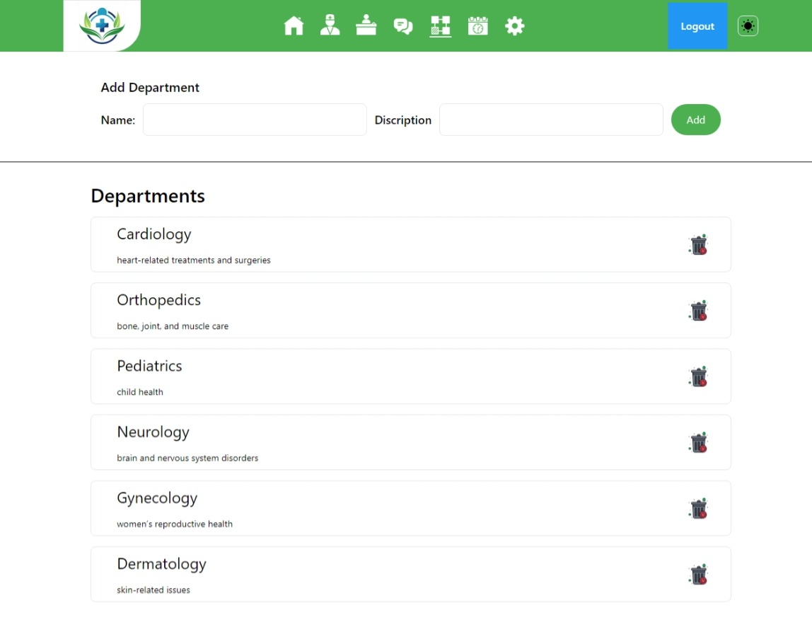

# 🏥 Hospital Management System (HMS)

A comprehensive Hospital Management System built with React.js frontend and Node.js backend with MongoDB database. This system provides role-based access for administrators, doctors, and receptionists to manage hospital operations efficiently.

## 📋 Table of Contents

- [Screenshots](#screenshots)
- [Features](#features)
- [Technology Stack](#technology-stack)
- [Project Structure](#project-structure)
- [Installation & Setup](#installation--setup)
- [Usage](#usage)
- [API Documentation](#api-documentation)
- [Contributing](#contributing)

## 📸 Screenshots

### 👨‍💼 Admin Panel


### 🏥 Department Management


### 👨‍⚕️ Doctor Management


### 👩‍💼 Receptionist Panel


### 🏠 Receptionist Home


### 👨‍⚕️ Doctor Settings


### 💬 Messages Management


### 📞 Contact Page


### ⚙️ Admin Settings


## ✨ Features

### 🔐 Role-Based Access Control
- **Admin Panel**: Complete system management
- **Doctor Panel**: Patient management and appointments
- **Receptionist Panel**: Appointment scheduling and patient registration

### 🏥 Core Functionalities
- **Appointment Management**: Schedule, view, and manage patient appointments
- **Department Management**: Organize hospital departments
- **Doctor Management**: Add, edit, and manage doctor profiles
- **Patient Registration**: Complete patient information management
- **Message System**: Internal communication between staff
- **File Upload**: Profile picture and document management

### 🎨 User Interface
- Modern, responsive design with Tailwind CSS
- Dark/Light theme toggle
- Interactive components with React
- Real-time updates and notifications

## 🛠 Technology Stack

### Frontend
- **React.js** - User interface framework
- **React Router** - Client-side routing
- **Tailwind CSS** - Utility-first CSS framework
- **Vite** - Build tool and development server
- **Axios** - HTTP client for API calls

### Backend
- **Node.js** - Server-side JavaScript runtime
- **Express.js** - Web application framework
- **MongoDB** - NoSQL database
- **Mongoose** - MongoDB object modeling
- **JWT** - Authentication and authorization
- **Multer** - File upload handling
- **bcryptjs** - Password hashing

## 📁 Project Structure

```
HMS/
├── Backend/                 # Node.js server
│   ├── models/             # MongoDB schemas
│   ├── routes/             # API routes
│   ├── uploads/            # File uploads
│   └── index.js            # Server entry point
├── Frontend/               # React application
│   ├── src/
│   │   ├── components/     # Reusable components
│   │   ├── pages/         # Page components
│   │   └── assets/        # Static assets
│   └── public/            # Public assets
└── Pics/                  # Project screenshots
```

## 🚀 Installation & Setup

### Prerequisites
- Node.js (v16 or higher)
- MongoDB (v4.4 or higher)
- npm or yarn package manager

### Step 1: Clone the Repository
```bash
git clone https://github.com/UmairZakria/hospital-management-system
cd HMS
```

### Step 2: Backend Setup
```bash
cd Backend
npm install
```

### Step 3: Database Setup
1. Start MongoDB service
2. The application will automatically connect to `mongodb://localhost:27017/client2`

### Step 4: Start Backend Server
```bash
npm start
# or
node index.js
```
The backend will run on `http://localhost:3001`

### Step 5: Frontend Setup
```bash
cd ../Frontend
npm install
```

### Step 6: Start Frontend Development Server
```bash
npm run dev
```
The frontend will run on `http://localhost:5173`

## 📖 Usage

### Accessing the Application
1. Open your browser and navigate to `http://localhost:5173`
2. You'll be redirected to the login page
3. Use the appropriate credentials based on your role

### Role-Based Access

#### 👨‍💼 Admin Access
- **URL**: `/admin`
- **Features**:
  - Manage all hospital departments
  - Add/Edit/Delete doctors and receptionists
  - View and manage appointments
  - Handle internal messages
  - System-wide settings

#### 👨‍⚕️ Doctor Access
- **URL**: `/doctor`
- **Features**:
  - View assigned appointments
  - Manage patient information
  - Update appointment status
  - Personal profile management

#### 👩‍💼 Receptionist Access
- **URL**: `/receptionist`
- **Features**:
  - Register new patients
  - Schedule appointments
  - Manage patient records
  - Handle walk-in appointments

## 🔌 API Documentation

The backend provides RESTful APIs for all operations. Key endpoints include:

### Authentication
- `POST /adminrigister` - Admin registration
- `POST /adminlogin` - Admin login
- `POST /doctorrigister` - Doctor registration
- `POST /doctorlogin` - Doctor login
- `POST /receptionistrigister` - Receptionist registration
- `POST /receptionistlogin` - Receptionist login

### Appointments
- `POST /appointment` - Create appointment
- `GET /apointcount` - Get appointment count
- `POST /appointdel` - Delete appointment
- `POST /apointupdate` - Update appointment status

### Departments
- `POST /adddep` - Add department
- `GET /getdep` - Get all departments
- `POST /depdel` - Delete department

### Messages
- `POST /message` - Send message
- `GET /getmessages` - Get all messages
- `POST /messagedel` - Delete message

For complete API documentation, see the `api.rest` file in the project root.


## 🤝 Contributing

1. Fork the repository
2. Create a feature branch (`git checkout -b feature/AmazingFeature`)
3. Commit your changes (`git commit -m 'Add some AmazingFeature'`)
4. Push to the branch (`git push origin feature/AmazingFeature`)
5. Open a Pull Request

## 📝 License

This project is licensed under the ISC License.

## 📞 Support

For support and questions, please contact the development team or create an issue in the repository.

---

**Note**: Make sure MongoDB is running before starting the application. The system uses local MongoDB instance by default. 
